# 👨‍💻 AFOLABI MUBARAK

## About Me

I'm a passionate **Software Engineer** with 6 years of hands-on experience building modern web and desktop applications. I specialize in creating scalable fullstack solutions and lightweight desktop applications using cutting-edge technologies.

### Tech Stack

**Languages:** JavaScript, TypeScript, Rust, Python

**Frontend:** React, Next.js, Tailwindcss, HTML, CSS, 

**Backend:** Node.js, Express.js, Docker

**Database:** PostgreSQL, MongoDB, MySQL, Drizzle ORM

**Desktop:** Tauri, Electron

**Other:** RESTful APIs, Real-time Applications

### What I Do

- 🌐 **Fullstack Development** - Building end-to-end web applications with React and Node.js
- 🖥️ **Desktop App Development** - Creating lightweight, performant desktop applications with Tauri
- **Backend Architecture** - Designing scalable server-side solutions with Express and PostgreSQL, Docker, Drizzle-ORM
-  **Modern Tools** - Leveraging TypeScript, Rust, and Python for robust applications

### 📍 Location

**Ogun, Nigeria**

---

*Let's build something amazing together!* 
